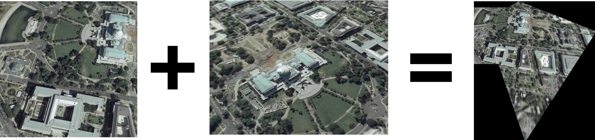
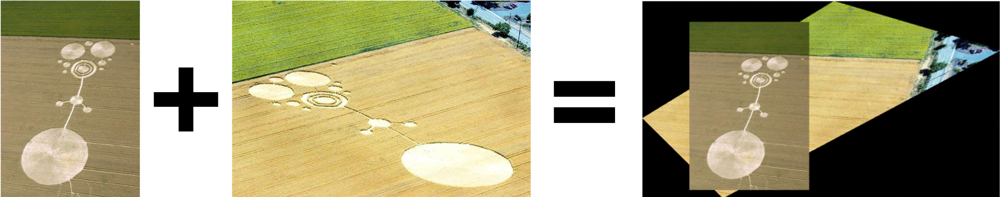
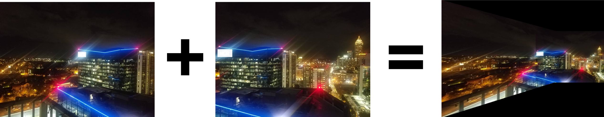

# Image Warping and Image Mosaics

## How to Run
The code contained in **mosaics.py** takes in 2 images and a set of corresponding points and warps the second image onto the reference image by computing a homography matrix for the set of matched points. If running for the first time, the code would require input from the user for the points. Run the following command to choose the points for the first time or use an existing points file a given set of images:
```
$ python3 mosaics.py ./path/to/data img_to_warp.jpg reference.jpg point_file_name.npy
```

## Examples
This repository already contains the point file for images in the _./examples/2/_ and _./examples/3/_ directory.

### Image Mosaic Examples

#### Example 1
To run for example 1:

```
$ python3 mosaics.py ./examples/1/ wdc1.jpg wdc2.jpg points.npy
```



#### Example 2


#### Example 3



### Image Warping Example
Here we warp the second image onto a frame selected in the first image.

#### Example 1

To run for the image warping example:

```
$ python3 mosaics.py ./examples/3/ nooo.jpg bb.jpg points.npy
```

